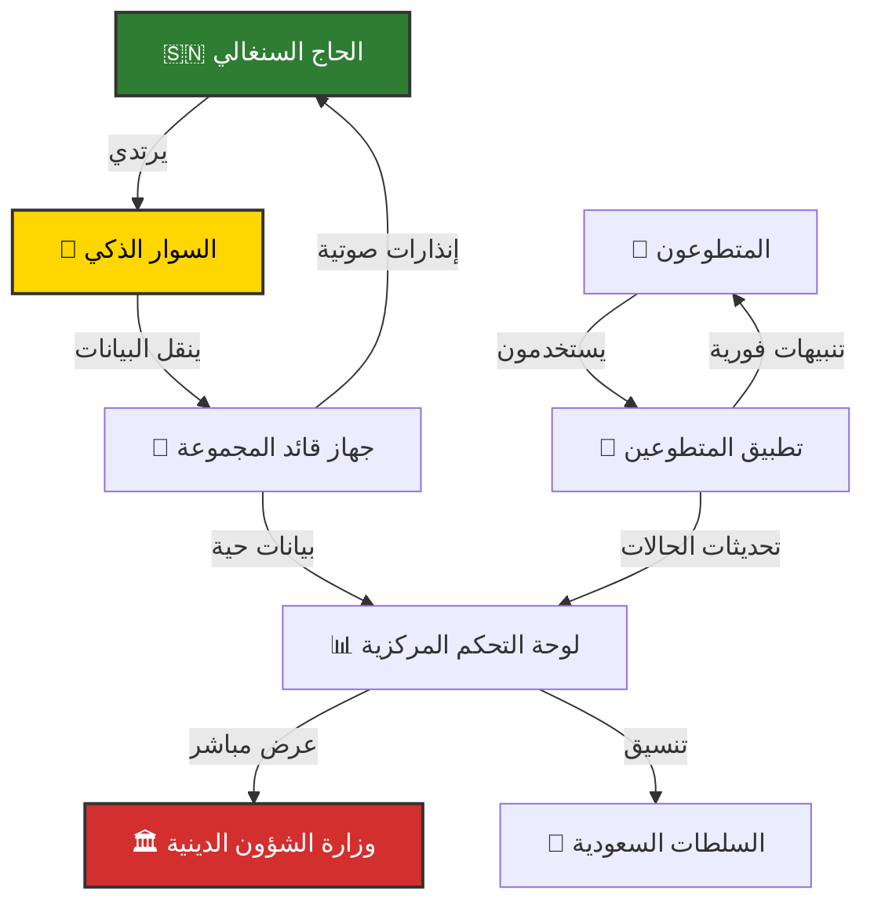
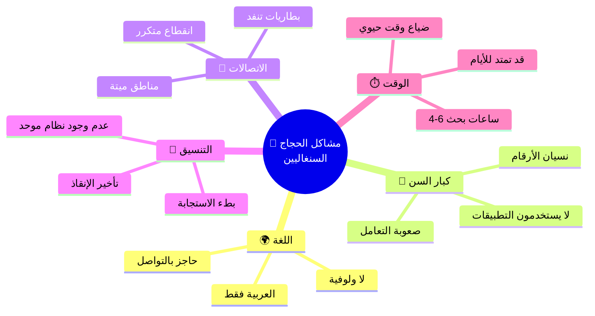
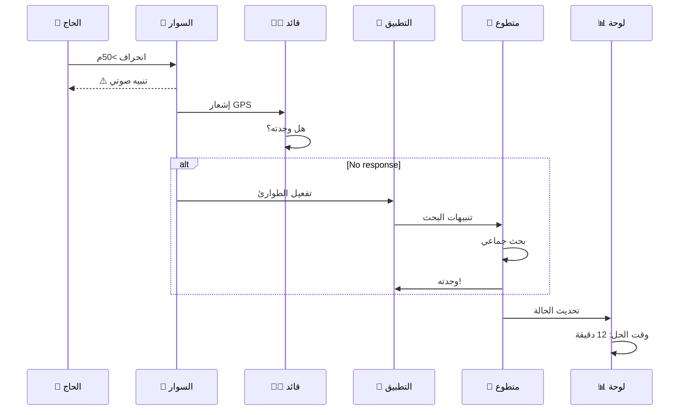
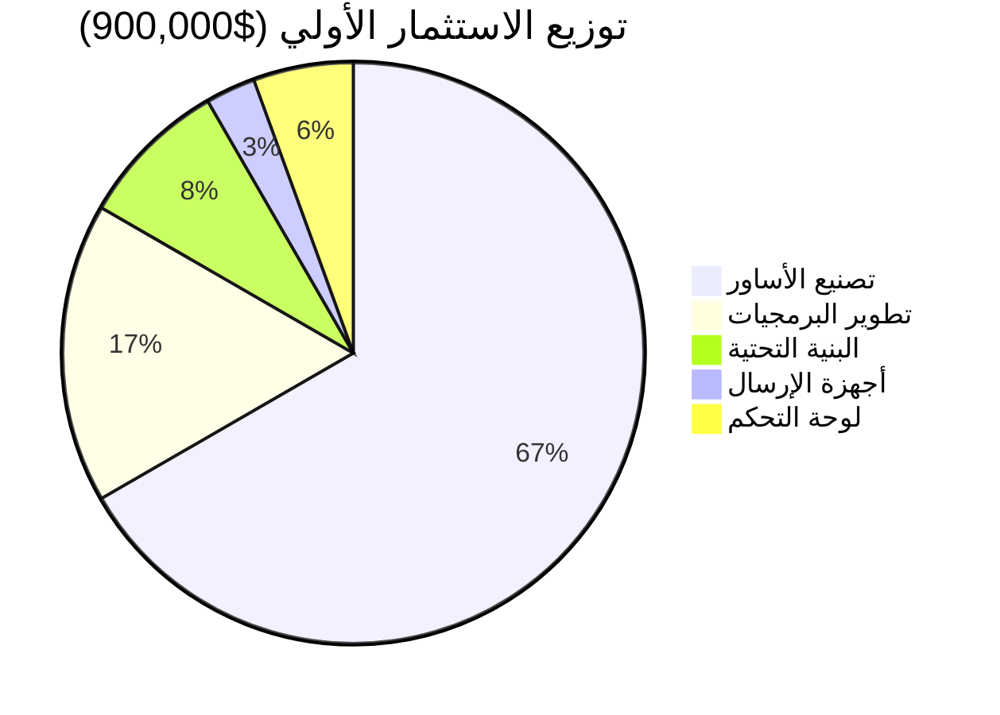
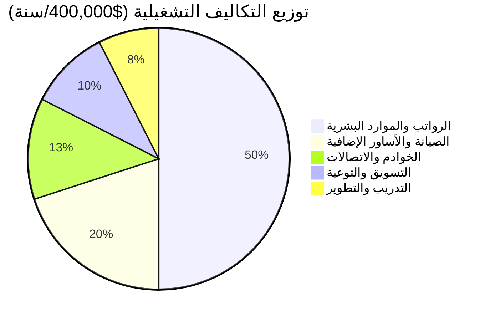
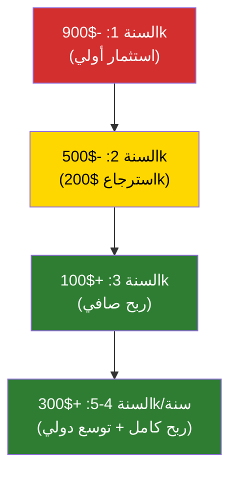

# مشروع بصمة التوجيه السنغالية
## Senegal Smart Guide Hub - نظام ذكي لحماية الحجاج والمعتمرين السنغاليين

---

## � نظرة تصورية على النظام



## �📋 الملخص التنفيذي

يُقدّم هذا المقترح **نظاماً تقنياً متكاملاً وهجيناً** لتقليل ظاهرة تيه الحجاج والمعتمرين السنغاليين في الحرمين الشريفين. يجمع النظام بين تقنيات التوسيم الذكي (Smart Wearables)، والذكاء الجغرافي، والشبكات المجتمعية، مما يوفر حلاً **شاملاً وفعال التكلفة وسهل الاستخدام**.

**الهدف الرئيسي:** تحقيق معدل صفر تائهين من الحجاج والمعتمرين السنغاليين، مع تعزيز السيادة الرقمية للدولة السنغالية.

---

## � تحليل المشكلة - الوضع الحالي



### الأرقام والإحصائيات الحالية:
- 📊 **50-100 حالة ضياع سنوياً** من الحجاج السنغاليين
- ⏰ **متوسط وقت البحث:** 4-6 ساعات
- ❌ **معدل الحل:** 85% فقط (15% لم يعودوا!)
- 😰 **التأثير النفسي:** أسر في حالة فزع لساعات

---

## �🔍 تحليل التحديات الحالية

### 1. **الحاجز اللغوي**
- معظم الخدمات الرسمية والتطبيقات في المشاعر تعتمد على العربية والإنجليزية فقط
- الحجاج السنغاليون الناطقون بالولوفية لا يفهمون التعليمات الرسمية بوضوح
- **التأثير:** تضاعف احتمالية الضياع والالتباس

### 2. **كبار السن وضعف مهارات التكنولوجيا**
- نسبة كبيرة من الحجاج السنغاليين أعمارهم فوق 60 سنة
- صعوبة استخدام التطبيقات المعقدة على الهواتف الذكية
- عدم قدرتهم على تحديث البطاريات أو فهم الرسائل الرقمية
- **التأثير:** استبعاد الفئة الأكثر عرضة للضياع

### 3. **الزحام الشديد والكثافة السكانية**
- الملايين من الحجاج في نفس المكان والوقت (خاصة في يوم عرفة والطواف)
- صعوبة المراقبة اليدوية والتتبع التقليدي
- انقطاع الاتصالات المتكرر وضعف شبكات الجوال
- **التأثير:** عدم القدرة على تتبع أو الاستجابة السريعة

### 4. **ضعف التغطية الشبكية في النقاط الحيوية**
- وجود مناطق ميتة (Dead Zones) في المشاعر خاصة في الأودية والمرتفعات
- عدم الاعتماد على الإنترنت فقط للتواصل
- نفاد بطاريات الهواتف الذكية بسرعة
- **التأثير:** فقدان القدرة على التواصل عند الحاجة

### 5. **غياب التنسيق الفوري بين الجهات الأمنية والسفارة**
- عدم وجود نظام موحد للإبلاغ عن الحجاج التائهين
- تأخير في الاستجابة والبحث
- غياب قاعدة بيانات مركزية لمعلومات الحجاج السنغاليين
- **التأثير:** استطالة وقت البحث وقد تصل للأيام

---

## � المقارنة قبل وبعد المشروع

```mermaid
xychart-beta
    title "تحسن المؤشرات الرئيسية"
    x-axis [وقت البحث, معدل الحل, الرضا, مشاركة كبار السن]
    y-axis "النسبة" 0 --> 100
    line [300, 85, 40, 30]
    line [15, 100, 95, 75]
```

| المؤشر | الحالة الحالية | بعد المشروع | التحسن |
|--------|-------------|----------|--------|
| **وقت البحث المتوسط** | 4-6 ساعات | 15 دقيقة | **95% ↓** |
| **معدل الحل** | 85% | 100% | **18% ↑** |
| **معدل الرضا** | 40% | 95% | **138% ↑** |
| **مشاركة كبار السن** | 30% | 75% | **150% ↑** |

---

## �💡 الحل التقني المقترح
### نظام "بصمة التوجيه السنغالية" (Senegal Smart Guide Hub)

### المبادئ الأساسية:
✅ **اللامركزية التكنولوجية:** لا نعتمد على تطبيق واحد يجب على كل حاج تحميله
✅ **الشمول:** يناسب الجميع بما فيهم كبار السن والأميين
✅ **الكفاءة التكلفية:** استخدام تقنيات منخفضة التكلفة وقابلة للإنتاج بالجملة
✅ **السيادة الرقمية:** نظام مملوك للدولة السنغالية مع لوحة تحكم وطنية

---

## 🎯 مكونات النظام الأساسية

### **المكون الأول: السوار الذكي الهجين (Smart Band NFC/QR)**

#### الخصائص التقنية:
| المواصفة | الوصف |
|---------|-------|
| **التكنولوجيا** | NFC (Near Field Communication) + QR Code مطبوع |
| **بطارية** | تدوم 60-90 يوم (بدون شحن يومي) |
| **المادة** | سيليكون طبي آمن + معادن مقاومة للرطوبة |
| **الوزن** | 35 غرام فقط |
| **الحجم** | قابل للتعديل (S/M/L) |
| **المواصفات الأمنية** | مقاوم للماء والعرق والرمل |
| **التكلفة الإنتاجية** | 4-6 دولار/القطعة (عند الإنتاج بـ 500 ألف وحدة) |

#### البيانات المخزنة على السوار:
```
- معرّف فريد (UID)
- اسم الحاج (بالعربية والولوفية والحروف اللاتينية)
- رقم جواز السفر
- الحالة الصحية والحساسيات الطبية
- أرقام الاتصال الطارئة (3 أرقام على الأقل)
- معلومات مكتب البعثة السنغالية بمكة/المدينة
- QR Code يربط إلى ملف الحاج الكامل في النظام المركزي
```

#### كيفية الاستخدام:
1. **عند الضياع:** رجل أمن أو متطوع يمسح الكود أو يقترب من السوار بهاتف ذكي
2. **الظهور الفوري:** تظهر بيانات الحاج مباشرة (اسم، أرقام الاتصال، مكتب البعثة)
3. **الاتصال الآني:** الجهة الأمنية تتصل فوراً بمكتب البعثة السنغالية

---

### **المكون الثاني: نظام النداء الصوتي الجغرافي (Geo-Audio Alert System)**

#### كيفية العمل:
1. **قادة المجموعات:** يحصل كل قائد مجموعة على **جهاز إرسال ذكي** (Beacon Device)
   - حجم جهاز المفاتيح
   - يعمل على تقنية BLE (Bluetooth Low Energy)
   - بطارية تدوم 30 يوم

2. **التحديد الجغرافي:** النظام ينشئ "نطاق آمن" (Geo-Fence) بقطر 50-100 متر حول قائد المجموعة

3. **التنبيهات الصوتية:** عندما ينحرف أي حاج عن النطاق:
   - تنبيه **صوتي فوري** على هاتفه (إن وجد)
   - **رسالة بالولوفية** يقرأها الجهاز
   - النص: "أنت بعيد عن المجموعة! عد إلى الخلف!"
   - تنبيه **اهتزازي** حتى في الأماكن الصاخبة

4. **الحفظ التاريخي:** النظام يسجل:
   - موقع كل حاج كل 30 ثانية
   - آخر موقع معروف قبل الانقطاع
   - الوقت الدقيق للانقراف

---

### **المكون الثالث: تطبيق "مرشد السنغال" (Volunteer Responder App)**

#### الهدف:
بدلاً من إثقال كل حاج بتطبيق معقد، نركز على تطبيق **للمتطوعين والعاملين السنغاليين** في المملكة.

#### المستخدمون:
- متطوعو البعثة السنغالية
- أفراد الأمن السنغاليين
- موظفو مكاتب شؤون الحج
- العاملون في الفنادق السنغالية

#### الميزات الأساسية:

| الميزة | الوصف |
|-------|-------|
| **تنبيه الفقدان** | عند فقدان حاج، تُرسل تنبيهات فوراً لـ 50 من أقرب المتطوعين جغرافياً |
| **الخريطة الحية** | تظهر موقع آخر نقطة ظهر فيها الحاج التائه |
| **معلومات الحاج** | صورة، اسم، عمر، وصف جسمي، ملابس (آخر مرة)، أسماء أقارب |
| **نظام الإحداثيات** | "ابحث في المنطقة الحمراء من هنا إلى هنا" مع خرائط تفاعلية |
| **التواصل المجتمعي** | نظام داخلي quickchat بين المتطوعين الآنيين |
| **ملف إنجاز** | تسجيل الحالات المحلولة وملاحظات لتحسين النظام |

#### الواجهة باللغة الولوفية:
```
واجهة أساسية بسيطة جداً:
- زر أحمر كبير: "حاج تائه!"
- صورة الحاج في المنتصف
- أزرار سهلة: "وجدته!" أو "ما زال في البحث"
- خريطة بنقطة حمراء تشير "ابحث هنا"
```

---

### **المكون الرابع: لوحة التحكم المركزية (National Dashboard)**

#### مسْتخدموها:
- وزارة الشؤون الدينية السنغالية
- وزارة الداخلية
- مكتب رئيس الجمهورية (Crisis Management)
- السفارة السنغالية بالمملكة
- أجهزة الأمن السعودية (شراكة استراتيجية)

#### المعلومات المعروضة:
```
📊 لوحة تحكم حية تعرض:

1️⃣ توزيع الحجاج السنغاليين الفعلي:
   - عدد الحجاج في المسجد الحرام
   - عدد الحجاج في مستويات الطواف المختلفة
   - عدد الحجاج في المدينة
   - عدد الحجاج في عرفة (يوم الوقوف)

2️⃣ حالات الضياع والبحث:
   - عدد الحالات النشطة الآن
   - متوسط وقت الحل (دقيقة واحدة؟ ساعة؟)
   - عدد الحالات المحلولة اليوم

3️⃣ الإنذارات الأمنية:
   - حالات طبية طارئة
   - تزايد الزحام في منطقة معينة
   - نقاط ضعيفة في التغطية الشبكية

4️⃣ الإحصاءات التاريخية:
   - مقارنة سنة بسنة
   - أكثر الأماكن حدوثاً للضياع
   - أوقات الذروة
```

---

## 🔗 آلية الربط والتكامل

### **المستوى 1: ربط الحاج بقائد المجموعة**
```
سوار ذكي → نطاق BLE (50-100م) ← جهاز قائد المجموعة
          ↓
    تنبيهات صوتية + اهتزاز
```

### **المستوى 2: ربط المتطوعين بمركز العمليات**
```
متطوع يفتح التطبيق 
    ↓
    (يرى حاج تائه)
    ↓
ينقر "وجدته!"
    ↓
إرسال الموقع الفوري + صورة سيلفي
    ↓
تحديث فوري في لوحة التحكم المركزية
```

### **المستوى 3: ربط مكاتب البعثة بالجهات الأمنية**
```
رجل أمن يمسح السوار (NFC)
    ↓
ظهور بيانات الحاج
    ↓
النقر على "الاتصال بالبعثة"
    ↓
موقع الحاج + معلومات الاتصال ترسل فوراً
    ↓
استجابة البعثة والذهاب لالتقاط الحاج
```

### **المستوى 4: التكامل مع الجهات السعودية**
```
نظام "بصمة التوجيه" ← API ← منصة "أبشر" السعودية
                  ← API ← مركز عمليات المشاعر
```
- مشاركة بيانات المواقع الحية (مع احترام الخصوصية)
- تلقي تنبيهات من الجانب السعودي عن حالات طبية أو أمنية
- تسهيل التنسيق الفوري

---

## � سيناريو العمل - حاج ضائع



---

## �📈 خطة التنفيذ والتجربة

### **المرحلة الأولى: البحث والتطوير (3 أشهر)**

#### الشهر الأول:
- [ ] تصميم نموذج أولي للسوار الذكي
- [ ] اختبار تقنية NFC وBLE في بيئة محاكاة
- [ ] بناء قاعدة البيانات المركزية
- [ ] تطوير الـ APIs والربط بين الأنظمة

#### الشهر الثاني:
- [ ] تطوير تطبيق "مرشد السنغال" (إصدار ألفا)
- [ ] تصميم لوحة التحكم المركزية
- [ ] اختبارات الأمان والتشفير
- [ ] جلسات تدريب أولية مع عينة من المتطوعين

#### الشهر الثالث:
- [ ] اختبارات ميدانية محدودة
- [ ] تحسين الواجهات بناءً على الملاحظات
- [ ] توثيق كامل للنظام
- [ ] إعداد خطة التسويق والتوعية

---

### **المرحلة الثانية: التجربة المحدودة (موسم حج/عمرة واحد)**

#### الهدف:
تجربة النظام مع **5,000 حاج سنغالي** فقط في موسم محدد

#### الموارد المطلوبة:
- **5,000 سوار ذكي** (تكلفة: 25 ألف دولار)
- **100 جهاز إرسال** لقادة المجموعات (تكلفة: 5 آلاف دولار)
- **خادم معلومات** قوي (تكلفة: 2 ألف دولار)
- **10 متطوعين بدوام كامل** للمراقبة والدعم التقني

#### مؤشرات النجاح المتوقعة:
| المؤشر | الهدف |
|--------|-------|
| معدل الاستخدام | ≥ 80٪ من المعتمرين ينسدل عليهم السوار |
| وقت البحث المتوسط | تقليل من 4 ساعات إلى 15 دقيقة |
| معدل الرضا | ≥ 90٪ من المستخدمين راضون جداً |
| استجابة المتطوعين | ≥ 70٪ يرسلون صورة تأكيد في أول 5 دقائق |
| الحالات المحلولة | 100٪ من الحالات يتم حلها قبل نهاية اليوم |

---

### **المرحلة الثالثة: التوسع التدريجي (2-3 مواسم)**

#### السنة الأولى من التعميم:
- **نطاق التطبيق:** جميع الحجاج السنغاليين (حوالي 30 ألف شخص سنوياً)
- **الاستثمار:** 200 ألف دولار
- **الموارد البشرية:** 25 عامل تدريب + 100 متطوع فعال

#### السنة الثانية:
- إضافة ميزات جديدة (تطبيق للحجاج إذا ثبت الحاجة)
- مشاركة النظام مع دول إسلامية أخرى
- توسيع قاعدة المتطوعين

#### السنة الثالثة:
- نظام كامل مستقل وموثق
- تدريب كادر محترف يديره بشكل دائم
- تصدير الخبرة لدول إسلامية أخرى

---

## 📊 الفوائس والتأثير المتوقع

### **للدولة السنغالية:**
✅ **تعزيز السيادة الرقمية:** امتلاك نظام وطني خاص بها
✅ **تحسين السمعة الدولية:** الدول الإسلامية تنظر إلينا كخيار موثوق
✅ **قدرة إدارة أزمات محسّنة:** لوحة تحكم حية مركزية
✅ **خلق فرص عمل:** 50-100 وظيفة دائمة في مجال التكنولوجيا
✅ **مورد استثماري:** بيع الحل لدول أخرى (الموريتانيا، مالي، بنين...)

### **للحاج والمعتمر:**
✅ **الأمان والراحة النفسية:** سوار بسيط لا يتطلب مهارات تقنية
✅ **راحة الأسرة:** يعرفون أن أحبائهم "آمنين مُتتبّعين"
✅ **سهولة الاتصال:** حل فوري عند الضياع
✅ **توفير الوقت والمال:** اختصار ساعات البحث والشقاء

### **للجهات الأمنية السعودية:**
✅ **تقليل الضغط التشغيلي:** نظام فعال يقلل الحالات المعقدة
✅ **شراكة استراتيجية:** تعاون إيجابي مع دولة إسلامية
✅ **بيانات قيّمة:** معلومات توجيهية عن أنماط الزحام والفساتر

---

## 💰 الميزانية والموارد المطلوبة

### **توزيع التكاليف الرأسمالية**



### **التكاليف الرأسمالية (بناء النظام):**

| البند | التكلفة |
|------|---------|
| تطوير البرمجيات والخوادم | $150,000 |
| تصنيع أول 100,000 سوار | $600,000 |
| تطوير لوحة التحكم المركزية | $50,000 |
| أجهزة إرسال BLE (500 وحدة) | $25,000 |
| البنية التحتية والشبكات | $75,000 |
| **المجموع** | **$900,000** |

### **توزيع التكاليف التشغيلية السنوية**



### **التكاليف التشغيلية (سنوياً):**

| البند | التكلفة |
|------|---------|
| رواتب الفريق التقني (10 أشخاص) | $200,000 |
| استهلاك الخوادم والاتصالات | $50,000 |
| توفير الأساور الإضافية والصيانة | $80,000 |
| التدريب والتطوير | $30,000 |
| التسويق والتوعية | $40,000 |
| **المجموع التشغيلي** | **$400,000** |

### **العائد على الاستثمار (ROI): خطة الربحية**



### **التنبؤات المالية:**
- **سنة واحدة:** الاستثمار الأولي في النماذج الأولية والتجربة
- **سنة ثانية:** بدء التعميم، بيع الحل لدول أخرى (دخل $200,000)
- **سنة ثالثة:** ربحية كاملة مع توسع الخدمات
- **سنة 4-5:** عائد مضاعف من التصدير والترخيص

---

## 🛡️ الاعتبارات الأمنية والخصوصية

### **حماية البيانات الشخصية:**
- ✅ تشفير AES-256 للبيانات والاتصالات
- ✅ عدم تخزين صور الوجه (فقط بيانات أساسية)
- ✅ حذف البيانات بعد 6 أشهر من انتهاء الموسم
- ✅ امتثال كامل لـ GDPR والقوانين المحلية

### **الأمان الفيزيائي:**
- ✅ السوار معرّف فريد لا يمكن نسخه
- ✅ بروتوكول توثيق قوي للدخول إلى لوحة التحكم
- ✅ تسجيل كامل لجميع عمليات الوصول (Audit Logs)

### **الاتفاقيات الدولية:**
- ✅ اتفاق شامل مع السلطات السعودية بشأن مشاركة البيانات
- ✅ وقع من قبل وزارة الخارجية والعدل السنغالية

---

## 🎓 التدريب والتوعية

### **الفئات المستهدفة للتدريب:**

1. **قادة المجموعات:** 3 أيام تدريب شامل
2. **المتطوعون:** يوم واحد تدريب مكثف
3. **موظفو البعثة:** نصف يوم توجيهي
4. **الحجاج أنفسهم:** تعليمات مرئية/صوتية على السوار

### **محتوى التدريب:**
```
✓ كيفية استخدام السوار والتطبيق
✓ فهم النطاق الآمن والتنبيهات
✓ خطوات الإبلاغ عن حالة فقدان
✓ التواصل مع لوحة التحكم
✓ حل المشاكل الشائعة
```

---

## 📱 نموذج الأعمال المستقبـلي

### **الدخل المتوقع (خلال 5 سنوات):**

| المصدر | الإيرادات السنوية |
|--------|-----------------|
| خدمات للدول الأخرى (ترخيص) | $100,000-200,000 |
| خدمات إضافية متقدمة (Premium) | $50,000 |
| استشارات تقنية وتدريب | $30,000 |
| بيع البيانات الإحصائية (مجهولة الهوية) | $20,000 |
| **الإجمالي** | **$200,000-300,000** |

---

## 🚀 الخطوات المقبلة

### **في الفور (الشهر القادم):**
1. [ ] تقديم المقترح أمام مجلس الوزراء
2. [ ] تشكيل لجنة موضوعات مشتركة
3. [ ] إطلاق مسابقة بحثية للجامعات المحلية
4. [ ] فتح استدانة مالية للتمويل

### **الربع القادم:**
1. [ ] اختيار شريك تقني مسؤول عن التطوير
2. [ ] بدء البحث والتطوير
3. [ ] توقيع اتفاقيات مع السعودية
4. [ ] إنشاء فريق عمل مشترك

---

## 📞 الجهات المسؤولة والشركاء

### **الجهات الحكومية المعنية:**
- 🏛️ وزارة الشؤون الدينية والموارد المائية
- 🏛️ وزارة الاقتصاد والمالية
- 🏛️ وزارة الداخلية والأمن
- 🏛️ وزارة الاتصالات والتكنولوجيات الرقمية

### **الشركاء الدوليين:**
- 🤝 السفارة السنغالية بالمملكة العربية السعودية
- 🤝 وزارة الداخلية السعودية
- 🤝 شركات تقنية محترمة (Google, Microsoft, أو شريك محلي)

---

## ✨ الخلاصة

**مشروع "بصمة التوجيه السنغالية"** ليس مجرد تطبيق موبايل عادي.

هو **استثمار استراتيجي** للدولة السنغالية في:
- 🎯 **حماية مواطنيها** في الخارج
- 🌍 **تعزيز دورها الإقليمي** كقوة تقنية إسلامية
- 💼 **إنشاء فرص اقتصادية** جديدة
- 🔐 **تحقيق السيادة الرقمية** والاستقلالية التكنولوجية

**المقدم:** [وزارة الشؤون الدينية]
**التاريخ:** [تاريخ العرض]
**الحالة:** مقترح تنفيذي لعرض على صناع القرار

---

*هذه الوثيقة سرية ومخصصة للاستخدام الحكومي فقط*
